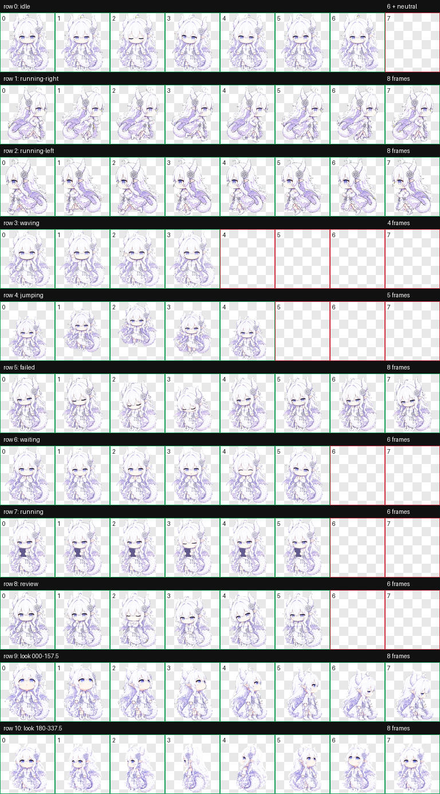

# chatgpt龙娘 Codex 桌宠

一个白紫色 Q 版龙娘 Codex v2 动画桌宠项目，包含最终精灵图集、9 组标准动作、16 个看向方向、逐帧素材以及完整 QA 记录。



## 最终成果

- 桌宠 ID：`chatgpt-longniang`
- 显示名称：`chatgpt龙娘`
- 精灵图版本：`spriteVersionNumber: 2`
- 图集规格：`1536 × 2288`，8 列 × 11 行，单元格 `192 × 208`
- 最终图集：[`final/spritesheet-extended.webp`](final/spritesheet-extended.webp)
- 验证结果：[`final/validation-extended.json`](final/validation-extended.json)
- QA 摘要：[`qa/run-summary.json`](qa/run-summary.json)

## 动作行

1. 待机
2. 向右跑
3. 向左跑
4. 挥手
5. 跳跃
6. 失败
7. 等待用户
8. 运行任务／看手机
9. 审查
10. 看向 `000°–157.5°`
11. 看向 `180°–337.5°`

最终修复版收紧了向左跑步的交替幅度，并保证看手机动作中的手机在全部 6 帧持续存在。其他标准动作和 16 个看向方向均通过保留性检查。

## 目录

- `final/`：最终图集和结构验证结果
- `frames/`：标准动作逐帧透明 PNG
- `decoded/`：生成后的完整动作条
- `qa/`：动画预览、接触表、方向和透明度验证
- `references/`：角色参考、布局参考和修复对照
- `prompts/`：各动作行生成提示词

## 本机安装位置

Windows 版 Codex 的安装目标为：

```text
%USERPROFILE%\.codex\pets\chatgpt-longniang\spritesheet.webp
```

安装时还需要同目录下的 `pet.json`，其中 `spriteVersionNumber` 必须为 `2`。

